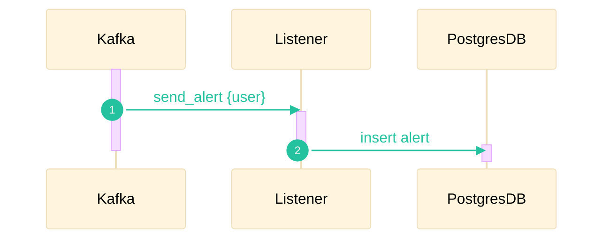
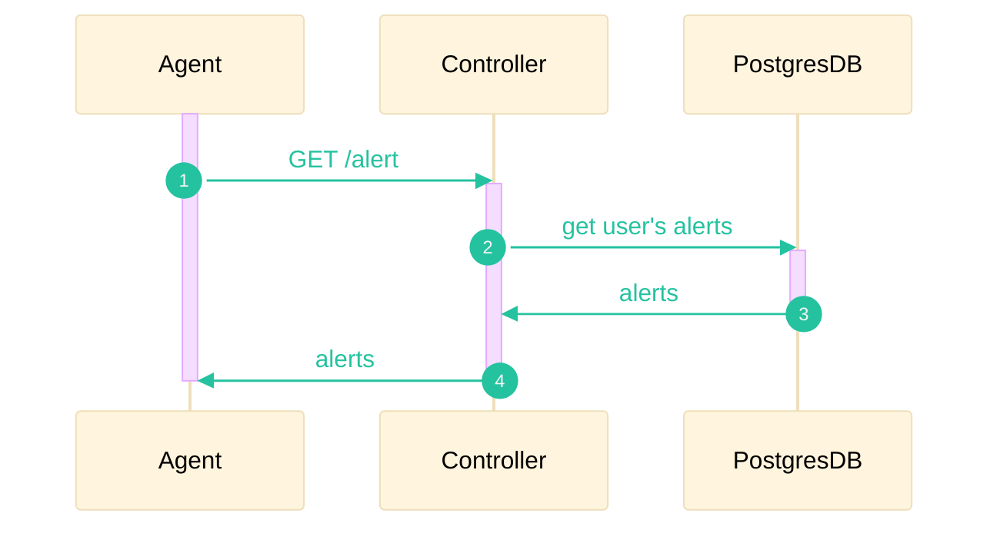
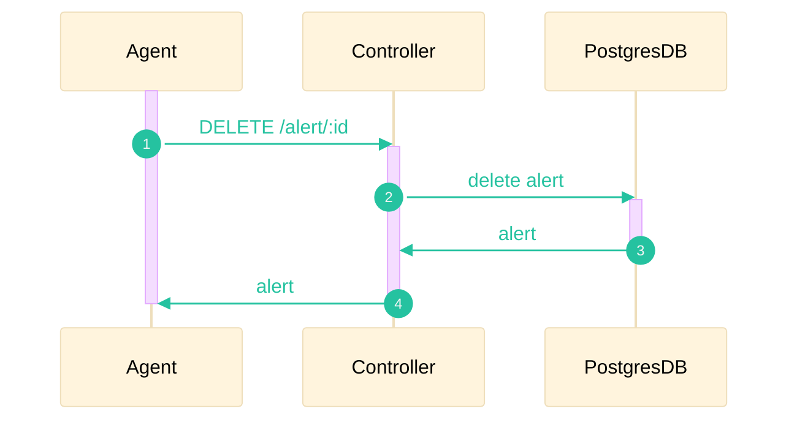

Le système d'alertes permet de notifier les potentiels cas contact au travers d'une simple API REST qui sera interrogée par un client frontend. Une alerte à une durée de validité de 7 jours (temps incubation et période contagieuse), après ce délai elle n'est plus considérée comme valide. La supression des alertes inactives se fait à l'aide de CronTab.

## Nouvelle alerte
L'ajout d'une nouvelle alerte est un processus asynchrone déclanché quand un membre est considéré comme cas contact.

## Consulter les alertes

## Supprimer une alertes

