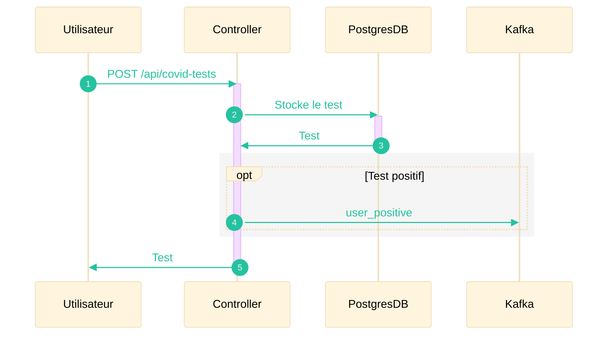
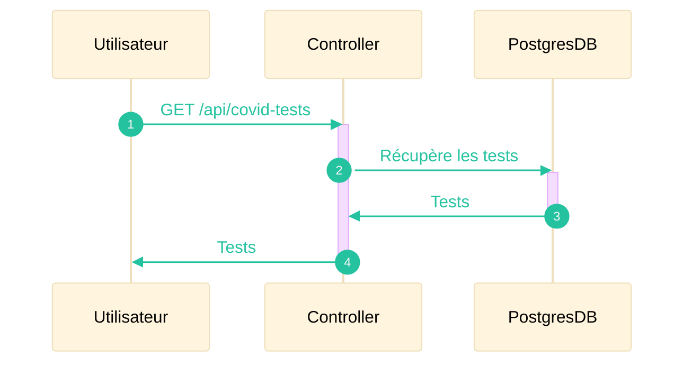
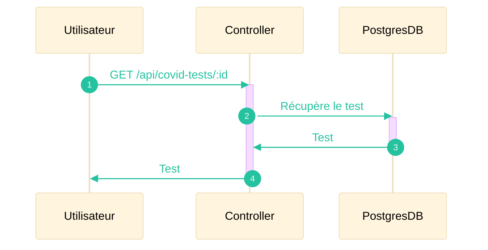
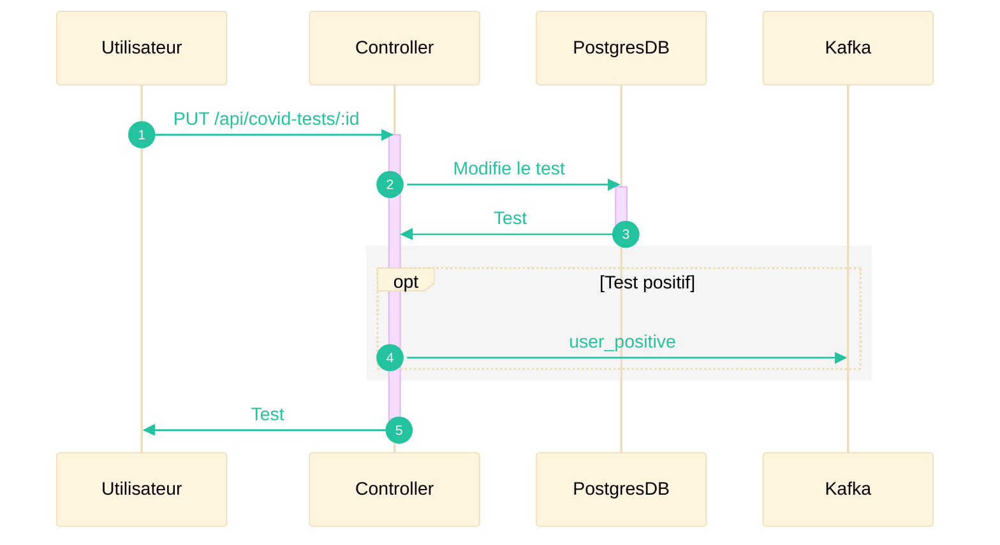
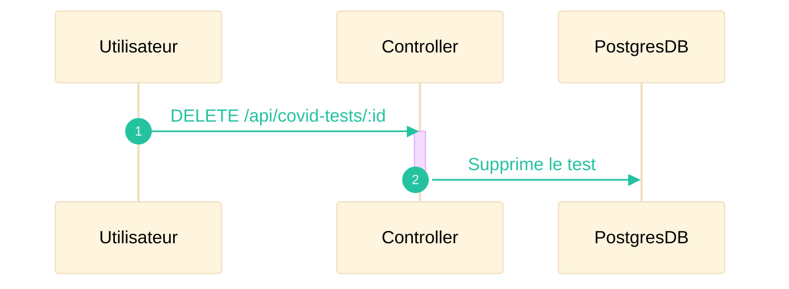

Le système de tests permet de mettre à disposition de l'utilisateur un suivi de ces tests concernant la Covid-19.

## Nouveau test

## Consulter les tests

## Consulter un test

## Modifier un test

## Supprimer un test

