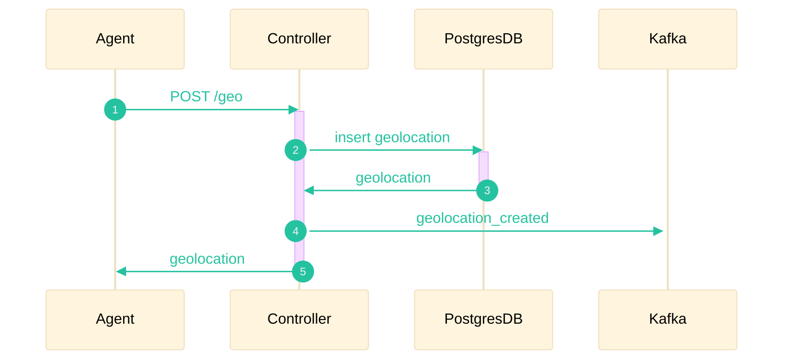
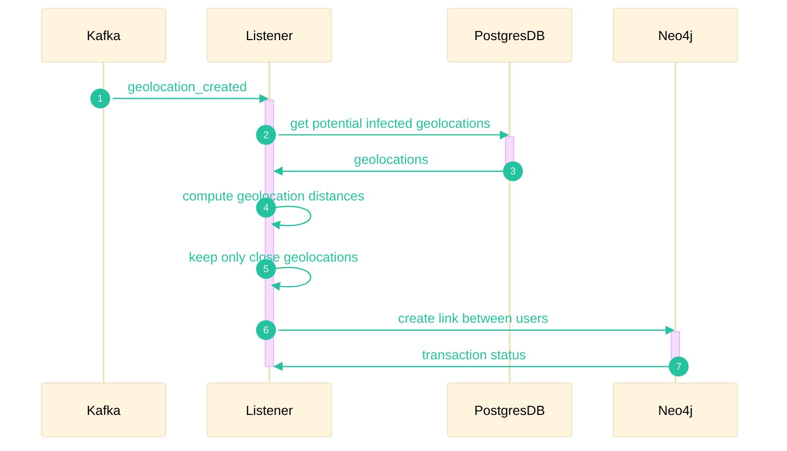
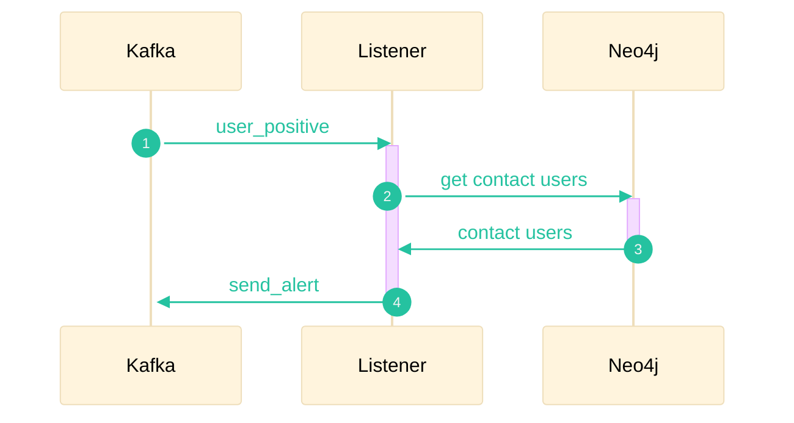

Le système de geolocalisation permet de tracer et retrouver efficacement les personnes contacts en présence d'un cas confirmé positif. Afin d'optimiser le traitement des requètes d'analyse nous avons opté pour deux bases de données :
- Une base de donnée [Postgres](https://www.postgresql.org/) pour persister les localisations (anonymisées) des utilisateurs
- Une base de donnée graphe [Neo4j](https://neo4j.com/) qui maintiendra le graphe de proximité des utilisateurs
  
Les localisations, tout comme les liens de proximité, seront gardées pour un délai maximum de 30 jours. La supression des données se fait à l'aide de CronTab.

## Nouvelle localisation
L'ajout d'une nouvelle localisation doit s'effectuer de manière synchrone et ne prendre que quelques millisecondes. Une fois la localisation enregistrée, le controller émet un évenement sur Kafka pour finaliser le processus de manière asynchrone.

## Mise à jour du graphe de proximité
Quand une localisation est enregistrée il faut mêtre à jour le graphe de proximité de manière asynchrone. Cette mise à jour peut avoir lieu juste après l'enregistrement ou alors quelques secondes plus tard, cela n'a pas d'importance. Pour ce faire, il faut récupérer toutes les localisations proches de celle qui vient d'être enregistrée dans un untervalle de temps de 5 minutes. Pour que deux localisations soient considérées comme proche il faut qu'il y ait une variation maximale de 0.1 deg pour la longitude et la latitude. Après avoir affiné le nombre de localisations à prendre en compts, il faut s'assurer que les localisations sont réellement proches en calculant la distance réelle qui les sépare. Seules les localisations très proches sont considérées lors de la mise à jour du graphe de proximité.

## Retrouver les personnes contacts
Lors d'un cas positif confirmé par un test, un listener est réveillé pour s'occuper de trouver les personnes contacts pour leur envoyer une alerte. La liste de ces personnes s'obtient grâce à notre graphe de proximité qui est très rapide et simple à parcourir (0-9ms). Il est possible de choisir le degré de contact qu'il faut considérer en récupérant une partie du sous-graphe partant de l'individu contaminé.

