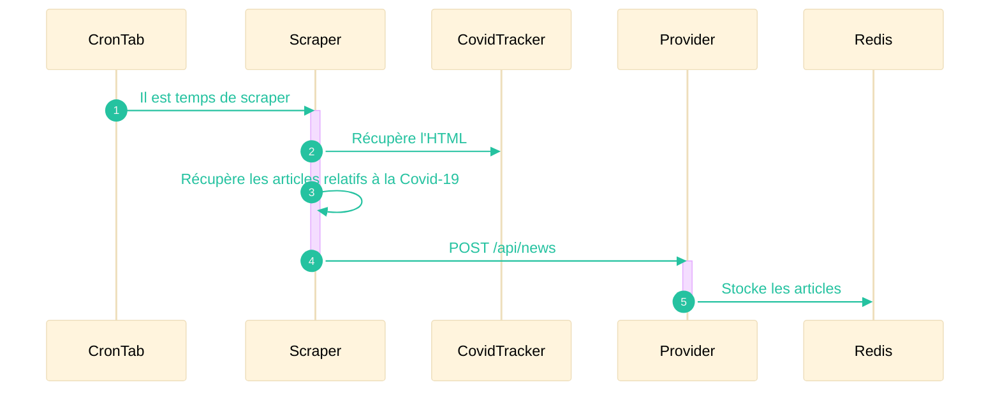
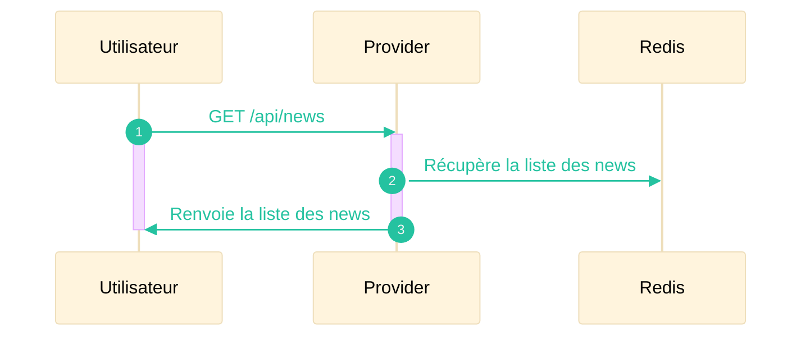

| Scraper | Provider |
|---------|----------|
|  |  |
| |  |

Le système de news permet de mettre à disposition des informations qui concernant la Covid-19 à l'utilisateur. Nous avons fait le choix de séparer celui-ci en deux microservices :
- Un scraper qui va récupérer les derniers articles parus sur [CovidTracker](https://covidtracker.fr/)
- Un provider qui aura pour rôle d'assurer la livraison des articles scrapés à l'utilisateur

Le déclenchement du scraper se fera à intervales réguliés par le biais d'un tâche cron.

## Mise à jour des news

## Récupération des news par l'utilisateur

