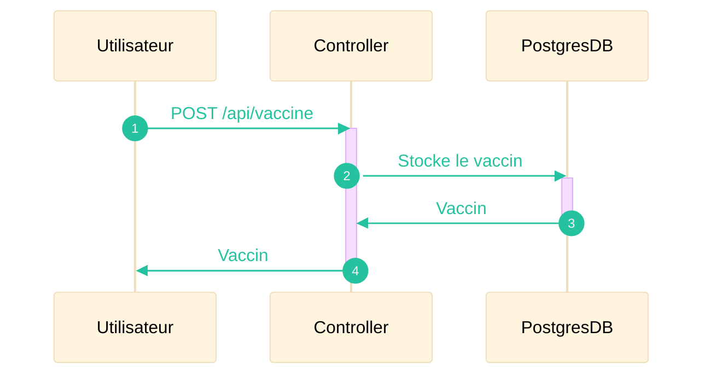
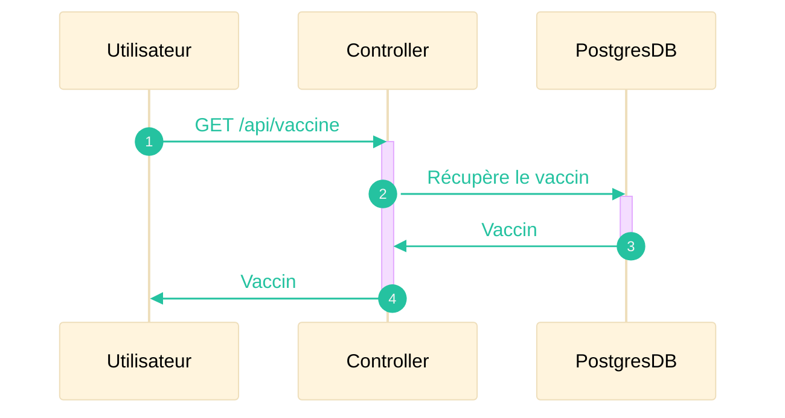
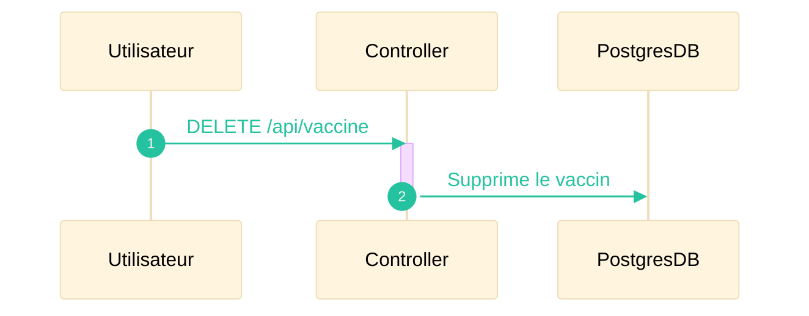

Le système de vaccins permet de mettre à disposition de l'utilisateur un suivi vaccinal concernant la Covid-19.
Ce vaccin étant unique, le système propose le stockage d'un seul vaccin. Si un vaccin existe déjà, la création d'un nouveau vaccin entrainera la modification du vaccin existant.

## Nouveau vaccin

## Consulter le vaccin

## Modifier le vaccin

## Supprimer le vaccin

