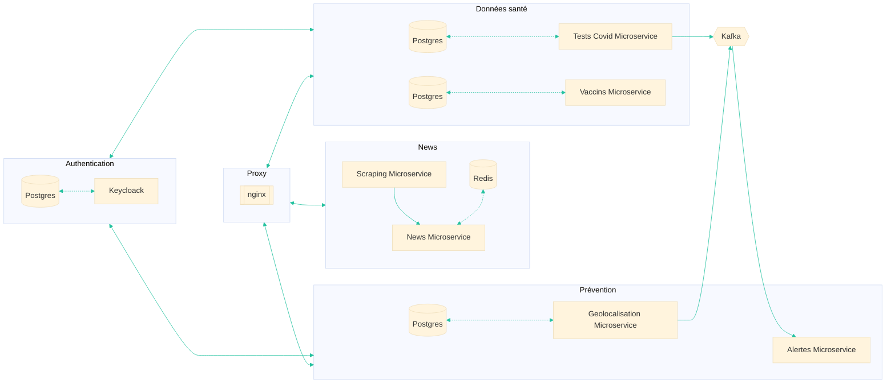

# Architecture

Comme indiqué dans précédemment dans le contexte du projet, nous devons réaliser ce dernier par le biais d'une architecture microservices. Cette page décrit l'architecture que nous avons adoptées mettant en exergue le découpage effectué.

## Schéma d'architecture

